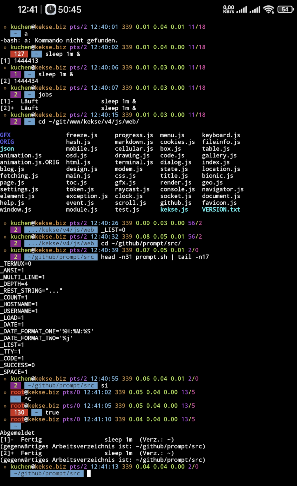

 

# My notorious **`$PS1`** prompt
By using the **`$PROMPT_COMMAND`** variable, this script dynamically
creates the **`$PS1` prompt**.

* [Version v**2.9.6**](src/prompt.sh) (updated **2025-12-05**)

 

 

* \[**2025-12-05**\] Update: now w/ `$_NEWLINE` setting (not yet in the [screenshot](#screenshot)) and the `$__PROMPT`; v**2.9.6**;

 

## Screenshot
Click on it to enlarge.

> [!NOTE]
> The screenshot doesn't contain the newest `$_NEWLINE` [configuration](#configuration) yet.

 

### Installation
Copy this file to the **`/etc/profile.d/`** directory. This should include it automatically
when spawning a new shell etc. (via `source` or `.`).

 

### Configuration
The configuration is located on top of the file (as simple variables, which will be enforced
into your environments where you include this script).

> [!TIP]
> If you want to test them, or just change the config during usage, you can easily
> **change the variables in your console**! Example given: `_LIST=0` will
> **temporarily** disable the directory listings. After/with the next login
> the values will be the original ones, right as defined in the script/file.

| Variable name           | Type    | Default    | Description                                                                                                                    |
| ----------------------: | ------: | :--------- | :----------------------------------------------------------------------------------------------------------------------------- |
| **`$_SUCCESS`**         | Boolean | 0          | Display success (`$?`), or only in case of errors?                                                                             |
| **`$_SPACE`**           | Boolean | 1          | Spaces between the blocks?                                                                                                     |
| **`$_CODE`**            | Boolean | 1          | Instead of indicating errors (return values != 0) with an ✘, the real error code is being displayed.                           |
| **`$_TTY`**             | Boolean | 1          | Includes the currently used **tty** in it's output                                                                             |
| **`$_LIST`**            | Boolean | 1          | When directory changes(!), you'll get to see it's contents.                                                                    |
| **`$_TERMUX`**          | Boolean | 0          | Will enforce some settings to fit better to the [`Termux` Linux](https://termux.dev/) (for Android phones)                     |
| **`$_ANSI`**            | Boolean | 1          | Here you could also disable all ANSI Escape Sequences (for colors and styles)                                                  |
| **`$_MULTI_LINE`**      | Boolean | 1          | Looks better when using a two line prompt                                                                                      |
| **`$_DEPTH`**           | Integer | 4          | The amount of directories to show in your current working directory.. see the [`getBase()`](#getbase) section                  |
| **`$_REST_STRING`**     | String  | `...`      | Also for the [`getBase()`](#getbase) function: the cut off parts of your current working directory are replaced by this string |
| **`$_COUNT`**           | Boolean | 1          | Will also show the amount of directories and regular files in the current working directory                                    |
| **`$_HOSTNAME`**        | Boolean | 1          | Also show your machine's hostname (if set, directly at the username)                                                           |
| **`$_USERNAME`**        | Boolean | 1          | Would also include your username in the output (if set, directly at the hostname)                                              |
| **`$_LOAD`**            | Boolean | 1          | The load average (parsing the `/proc/loadavg`; if not readable or available, it'll be ignored)                                 |
| **`$_DATE`**            | Boolean | 1          | Depends on the both variables below [ `$_DATE_FORMAT_ONE` and `$_DATE_FORMAT_TWO` ]                                            |
| **`$_DATE_FORMAT_ONE`** | String  | `%H:%M:%S` | First `date` format; by default only the current time (the date in the `$_DATE_FORMAT_TWO`)                                    |
| **`$_DATE_FORMAT_TWO`** | String  | `%j`       | Second `date` format; by default the number of current days in the year                                                        |
| **`$_NEWLINE`**         | Boolean | 1          | Start the prompt output with an empty line                                                                                     |

The `Boolean` types are just `Integer` values with either `0` as `false` or `1` as `true`.

 

### Details
It's also using **ANSI Escape Sequences** to colorize up the prompt (if you don't disable it via `$_ANSI`
[configuration](#configuration) variable).

#### `$__PROMPT`
This variable is defined to count how many times a prompt was constructed.

Currently there's just one reason for it: the `$_NEWLINE`.. but since it doesn't disturb anything, it's 'O.K.'...

#### `getBase()`
It also has a `getBase()` function to reduce the amount of slash `/` separators in the directory depth..
with a bit of intelligence. See also the [configuration](#configuration) variables [ `$_SLASHES`, `$_REST_STRING` ];

  

# Contact

# Copyright and License
The Copyright is [(c) Sebastian Kucharczyk](./COPYRIGHT.txt),
and it's licensed under the [MIT](./LICENSE.txt) (also known as 'X' or 'X11' license).

