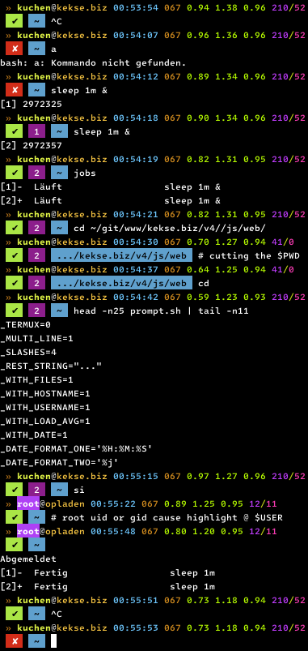

# My notorious **`$PS1`** prompt
By using the **`$PROMPT_COMMAND`** variable, this script dynamically created the **`$PS1` prompt**.

* [Version **v2.1.3**](sh/prompt.sh) (updated **2024-06-14**)

## Screenshot

### Installation
Copy this file to `/etc/profile.d/[prompt.sh]`. This should `source` (`.`) it automatically.

**If** it won't work, the reason could be other scripts or so: in this case you could find
a solution via `grep -ri PS1`, e.g..

### Configuration
The configuration is located on top of the file.

| Variable name           | Type    | Default    | Description                                                                                                                    |
| ----------------------: | ------: | :--------- | :----------------------------------------------------------------------------------------------------------------------------- |
| **`$_TERMUX`**          | Boolean | 0          | Will enforce some settings to fit better to the [`Termux` Linux](https://termux.dev/) (for Android phones)                     |
| **`$_ANSI`**            | Boolean | 1          | Here you could also disable all ANSI Escape Sequences (for colors and styles)                                                  |
| **`$_MULTI_LINE`**      | Boolean | 1          | Looks better when using a two line prompt                                                                                      |
| **`$_SLASHES`**         | Integer | 4          | The amount of directories to show in your current working directory.. see the [`getBase()`](#getBase) section                  |
| **`$_REST_STRING`**     | String  | `...`      | Also for the [`getBase()`](#getBase) function: the cut off parts of your current working directory are replaced by this string |
| **`$_WITH_FILES`**      | Boolean | 1          | Will also show the amount of directories and regular files in the current working directory                                    |
| **`$_WITH_HOSTNAME`**   | Boolean | 1          | Also show your machine's hostname (if set, directly at the username)                                                           |
| **`$_WITH_USERNAME`**   | Boolean | 1          | Would also include your username in the output (if set, directly at the hostname)                                              |
| **`$_WITH_LOAD`**       | Boolean | 1          | The load average (parsing the `/proc/loadavg`; if not readable or available, it'll be ignored)                                 |
| **`$_WITH_DATE`**       | Boolean | 1          | Depends on the both variables below [ `$_DATE_FORMAT_ONE` and `$_DATE_FORMAT_TWO` ]                                            |
| **`$_DATE_FORMAT_ONE`** | String  | `%H:%M:%S` | First `date` format; by default only the current time (the date in the `$_DATE_FORMAT_TWO`)                                    |
| **`$_DATE_FORMAT_TWO`** | String  | `%j`       | Second `date` format; by default the number of current days in the year                                                        |

### Details
It's also using **ANSI Escape Sequences** to colorize up the prompt!

//**TODO**/describe more details, and more to the [implementation](#implementation) below..//

### Implementation
Some details to my implementation.

#### `getBase()`
It also has a `getBase()` function to reduce the amount of slash `/` separators in the directory depth..
with a bit of intelligence. See also the [configuration](#configuration) variables [ `$_SLASHES`, `$_REST_STRING` ];

# Copyright and License
The Copyright is [(c) Sebastian Kucharczyk](./COPYRIGHT.txt),
and it's licensed under the [MIT](./LICENSE.txt) (also known as 'X' or 'X11' license).

